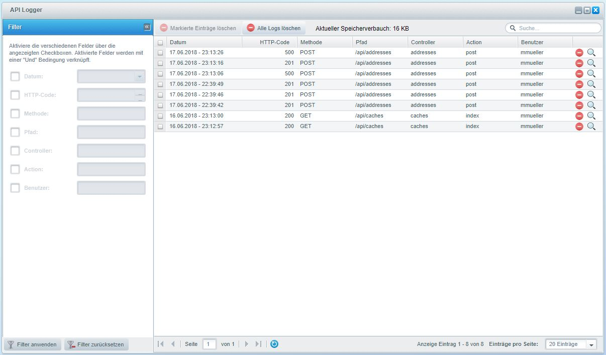
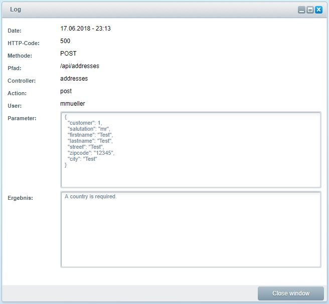
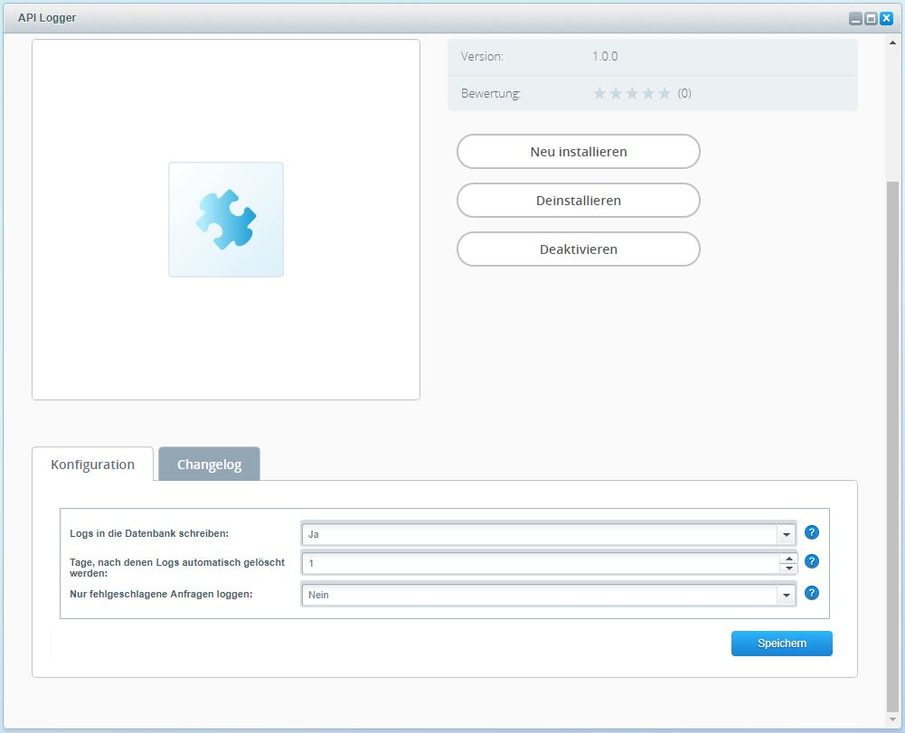

# API Logger

## Features

Mit diesem Plugin loggen Sie alle Anfragen an die API Ihrer Shopware Installation:

* Speichern der Logs in der Datenbank (nicht in Dateien)
* Backend-Erweiterung mit Übersicht aller Anfragen
* Listenansicht mit Datum, HTTP-Code, Methode, Pfad, Controller, Action und Benutzer der Anfragen
* Detailansicht zusätzlich mit Parametern und Ergebnis der Anfrage
* Suche und Filterung der Liste möglich
* Manuelles Löschen aller oder ausgewählter Logs möglich
* Automatisches Löschen von Logs durch einen Cronjob möglich
* Konfigurationsmöglichkeit, um nur fehlgeschlagene Anfragen zu loggen
* Perfekt zum dauerhaften Loggen Ihrer API Anfragen oder für Debug-Zwecke

## Installation

Das Plugin kann normal über das Shopware Backend installiert werden. Mehr dazu finden Sie in der
<a href="https://community.shopware.com/Plugin-Manager-ab-Shopware-5_detail_1856_643.html" target="_blank">Bedienungsanleitung von Shopware</a>.

## Konfiguration

Wenn Sie über den Plugin Manager die Konfiguration des API Logger Plugins öffnen, haben Sie dort folgende Einstellungsmöglichkeiten:

1. Logs in die Datenbank schreiben

    Hierüber lässt sich der Logger an- oder ausschalten. Wenn man den Logger stoppen möchte, muss man nicht erst das ganze 
    Plugin deaktivieren, sondern kann das über diese Einstellung regeln. Somit bleibt der Menü-Punkt des API Loggers im
    Backend weiterhin erhalten, wenn man den Logger ausschaltet, was nicht der Fall wäre, wenn man das ganze Plugin 
    deaktiviert.

2. Nur fehlgeschlagene Anfragen loggen

    Wählen Sie aus, ob nur fehlgeschlagene Anfragen an die API geloggt werden sollen. In dem Fall werden nur die Anfragen geloggt,
    die einen HTTP Status Code größer oder gleich 400 haben. Wenn Sie sich nur für die fehlgeschlagenen Anfragen interessieren,
    können Sie diese Einstellung benutzen und Speicherplatz sparen.
    
3. Tage, nach denen Logs automatisch gelöscht werden

    Standardmäßig werden keine Logs automatisch gelöscht. Im Normalfall müssen Sie das über die Log-Übersicht manuell regeln.
    Wenn Sie allerdings in dieser Einstellung eine Zahl eintragen, sorgt ein Cronjob dafür, dass Logs, die älter als Ihre
    angegebene Anzahl an Tagen sind, automatisch gelöscht werden. Standardmäßig wird der Cronjob ein mal am Tag aufgerufen
    und dann werden alle betroffenen Logs gelöscht. Wenn Sie möchten, dass der Cronjob mehrmals am Tag ausgeführt wird,
    um regelmäßiger die betroffenen Logs zu löschen, müssen Sie wie folgt das Intervall verändern:
    
    Im Backend unter "Einstellungen->Grundeinstellungen->System->Cronjobs" wählen Sie den Cronjob "Remove API Logs" und setzen
    das Intervall auf den gewünschten Wert.

## Benutzung

Die Log-Übersicht finden Sie im Backend unter "Einstellungen->API Logger". Hier sehen Sie alle geloggten Anfragen absteigend
nach Datum sortiert. Im linken Bereich des Fensters können die angezeigten Logs gefiltert werden, um sich zum Beispiel alle Logs 
mit einem bestimmten HTTP-Code anzeigen zu lassen. Setzen Sie dafür den Haken neben dem jeweiligen Feld und geben Sie einen Wert
ein. Bestätigen Sie mit einem Klick auf "Filter anwenden". In der Toolbar oben können Sie entweder ausgewählte Logs löschen
oder alle Logs auf einmal. Die Suche funktioniert ähnlich wie der Filter, nur dass hier alle Felder nach dem eingegebenen Text
durchsucht werden. Über die Optionen-Spalte können einzelne Logs gelöscht werden und die Detail-Ansicht eines Logs geöffnet 
werden. In der Detail-Ansicht haben sie Überblick über folgende Informationen:

* Datum: Datum der Anfrage
* HTTP-Code: <a href="https://de.wikipedia.org/wiki/HTTP-Statuscode" target="_blank">HTTP-Response-Code</a> der Anfrage
* Methode: HTTP-Methode der Anfrage
* Pfad: Adressierter Pfad der Anfrage
* Controller: Adressierter Controller der Anfrage
* Action: Adressierte Controller Action der Anfrage
* Benutzer: Backend Benutzer, über den die Anfrage stattgefunden hat
* Parameter: Parameter, die bei der Anfrage mit übergeben wurden
* Ergebnis: Ergebnis der Anfrage (Antwort im JSON Format oder Fehlermeldung als Text) 

## Screenshots

### Log-Übersicht

### Detail-Ansicht

### Plugin-Konfiguration

